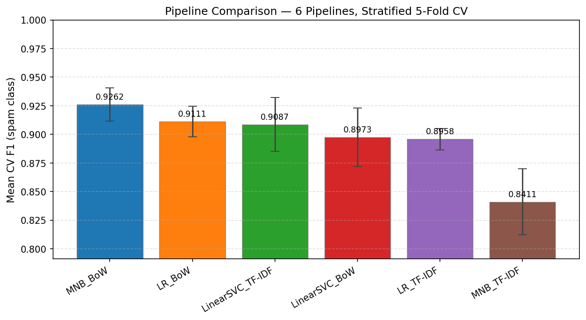
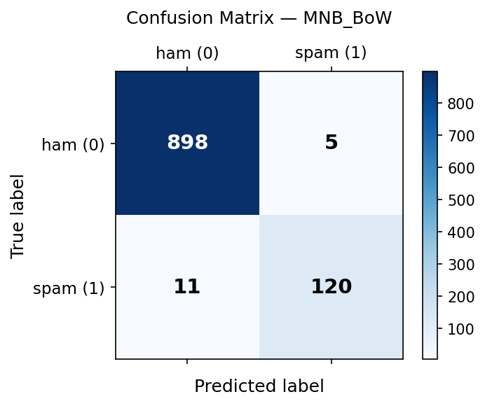
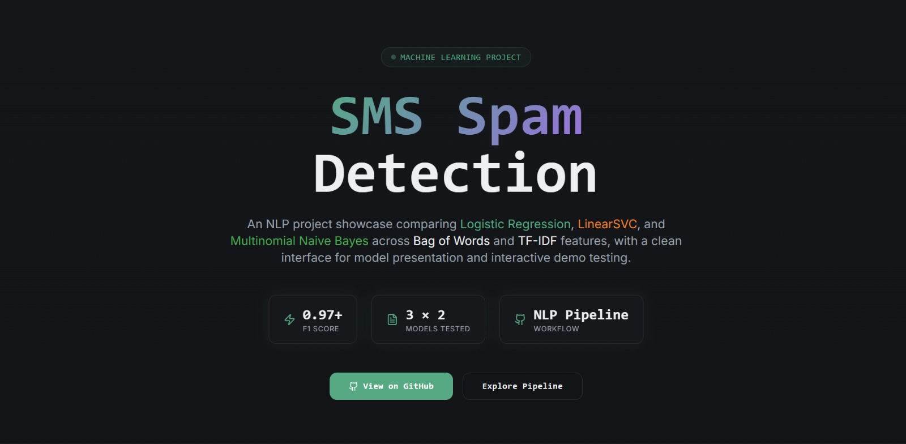
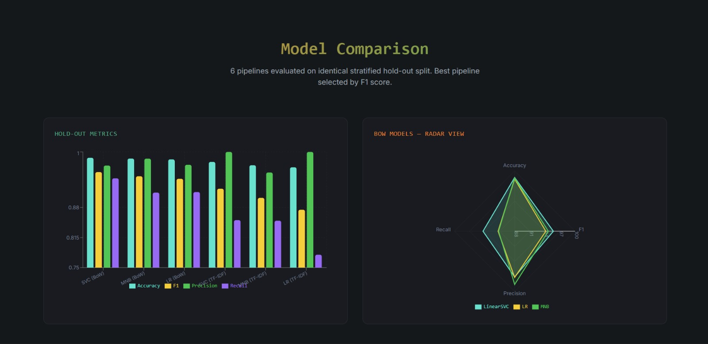
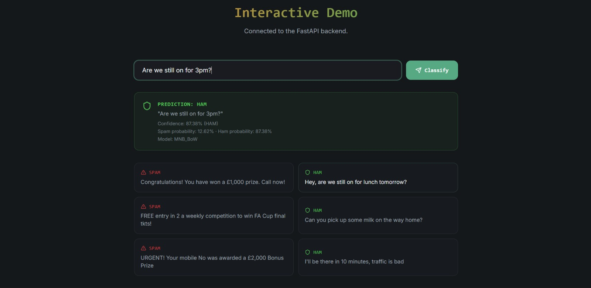
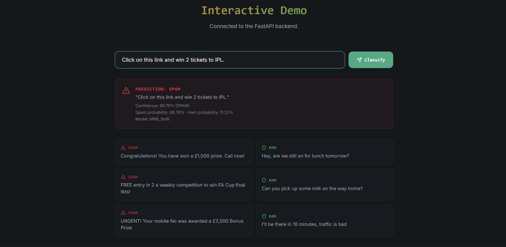

# SMS Spam Classifier


An end-to-end SMS spam classifier built with classical NLP and scikit-learn.

It compares 6 pipelines across **Bag-of-Words** and **TF-IDF**, selects the best model using **stratified 5-fold CV**, serves predictions through **FastAPI**, and includes a **React frontend** for interactive testing.

## Results

| Metric | Value |
|--------|-------|
| Best pipeline | `MNB_BoW` |
| CV F1 | `0.9262 ± 0.0145` |
| Holdout test F1 | `0.9375` |
| Holdout test accuracy | `0.9845` |




> `results/` and `models/best_pipeline.pkl` are committed intentionally so reviewers can inspect outputs without rerunning training. The project remains reproducible with `python -m src.train`.

## Screenshots

### Homepage


### Model Comparison


### Interactive Demo



## Tech Stack

- Python
- scikit-learn
- pandas / NumPy
- FastAPI
- React + TypeScript
- Vite

## What I built

- text preprocessing pipeline
- model comparison and evaluation workflow
- train/test + cross-validation setup
- FastAPI inference API
- CLI prediction flow
- frontend integration for live spam prediction
- artefact generation (`results/*.json`, `*.csv`, `*.png`)

## Why classical ML?

The SMS Spam Collection dataset is relatively small, sparse, and keyword-driven, which makes classical models strong baselines. For this project, they were faster to train, easier to interpret, and more appropriate than a heavier deep learning setup.

## Project Structure

```text
sms-spam-classifier/
├── src/        # training, preprocessing, inference, API
├── tests/      # loader, preprocessing, prediction tests
├── web/        # React frontend
├── results/    # generated metrics, plots, CSV/JSON outputs
├── models/     # serialized trained pipeline
└── data/       # dataset instructions